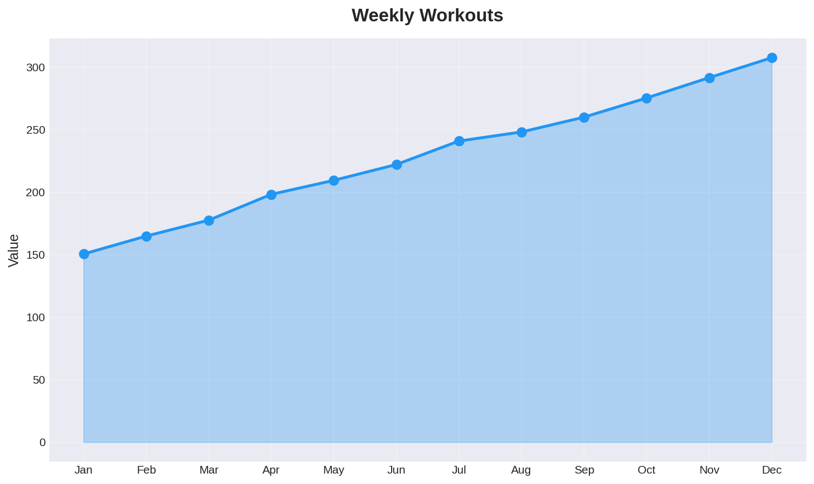
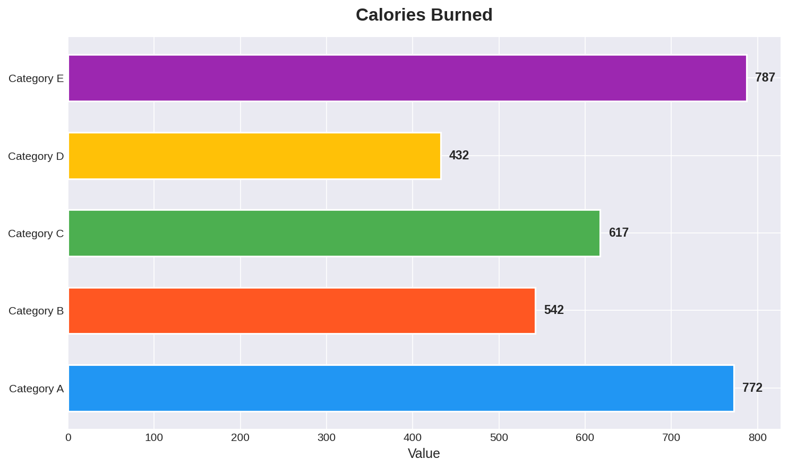
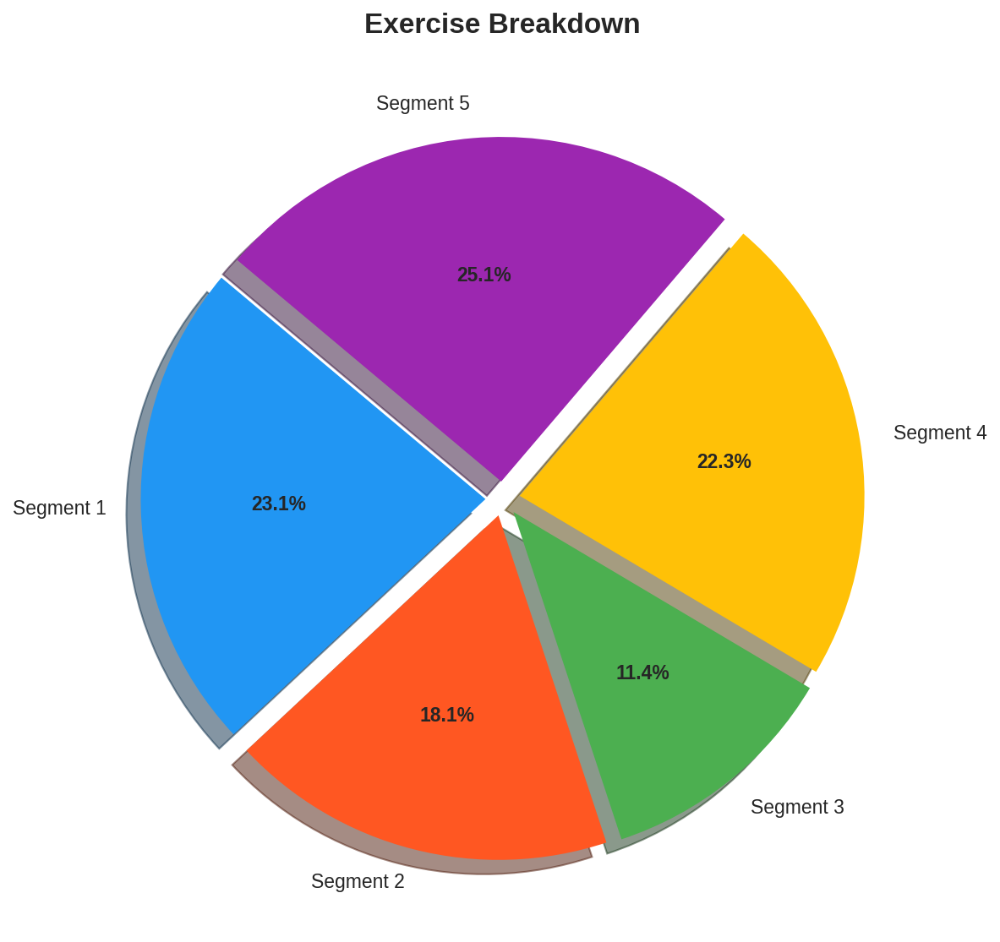
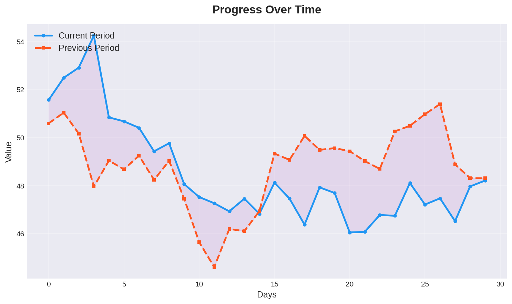

# Fitness Tracker Dashboard

This is a production-ready Python dashboard project for tracking personal fitness. The dashboard uses Streamlit as the main framework and includes features such as workout stats, calorie tracking, and progress visualization.

## Features

*   Workout stats: view your workout history and track your progress
*   Calorie tracking: monitor your daily calorie intake and stay on top of your nutrition
*   Progress visualization: see how far you've come and set goals for the future

## Requirements

*   Python 3.8+
*   Streamlit 1.25.0
*   Pandas 1.4.3
*   Plotly 5.10.0
*   Matplotlib 3.5.1
*   NumPy 1.22.3

## Installation

1.  Clone the repository: `git clone https://github.com/your-username/fitness-tracker-dashboard.git`
2.  Install the requirements: `pip install -r requirements.txt`
3.  Run the application: `streamlit run app.py`

## Usage

1.  Run the application: `streamlit run app.py`
2.  Open your web browser and navigate to `http://localhost:8501`
3.  Select a page from the sidebar to view the corresponding dashboard

## Contributing

Contributions are welcome! If you'd like to contribute to this project, please fork the repository and submit a pull request.

## License

This project is licensed under the MIT License. See the [LICENSE](LICENSE) file for details.
## Changelog
- v2.5.0: Dashboard improvements
